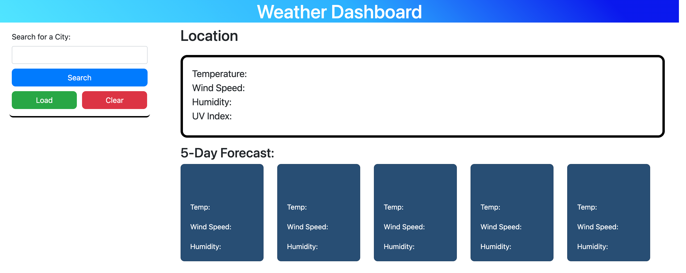

# Challenge #6 - Weather Dashboard

## Description

    This project was about using Api's to pull information from a particular source and display it dynamically based on user input. Once the user types in a city name, it pulls up the current weather information along with the next 5 days along the bottom of the page. It also stores the previous searches from the user in a list of buttons below the search bar, adding a new one each time the user searches.

## Experience Gained

    This challenge was enjoyable to put together, despite all the various pieces that need to be carefully meshed together. Through experimenting with the fetch().then methods, I understand how to implement them much better. I also was able to take the api url from the weather api and used it to remove the longitude and latitude values, then placed them into a new api url to find the more detailed information (UV index in particular). The second challenge that I came across had to do with saving and loading the information from local storage. Once that was fixed, I had to modify the for loop, so that it would not repeat past cities into future buttons. The only piece that I has given me the most trouble and I was not able to tweak quite enough was the button functionality for the previously searched cities.

## Important Notes:

    Rather than having the past cities load on a page refresh, I found it easier to implement a button to handle that functionality for me. Clicking load will pull the previous cities from local storage and display them under the search section along the left side of the page. I also implemented a clear button, so I did not have to click on the various tabs in the chrome developer tools to clear the local storage.

## GitHub Links (Deployed Site and Repository)

    The project deployment can be seen at: https://ekball.github.io/C6-Weather-Dashboard/

    The repository link: https://github.com/ekball/C6-Weather-Dashboard

## Deployed Site Screenshot

